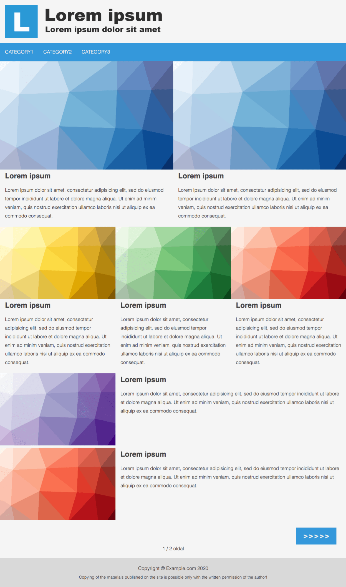
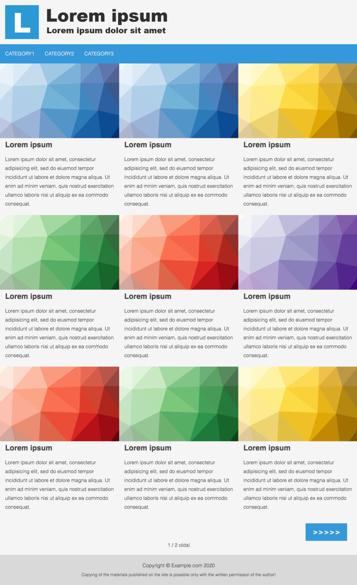
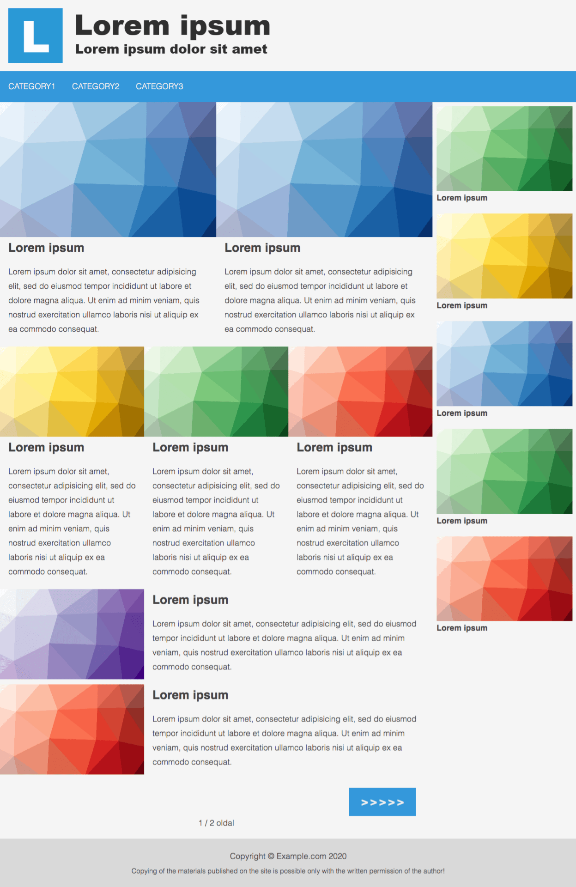
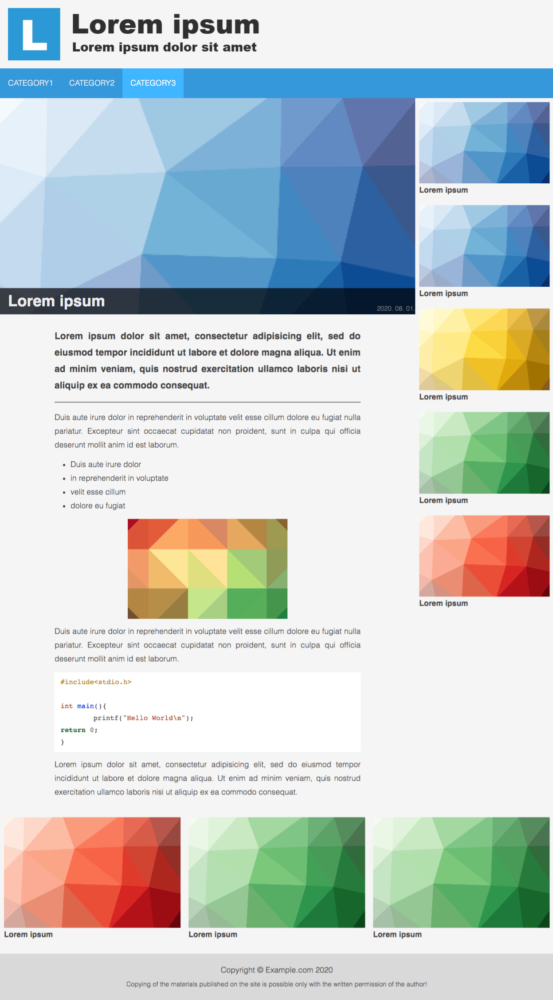

## Simple Jekyll blog

A simple minimalist blog theme for Jekyll built with [lori.css](https://hlorand.github.io/lori.css/)

- Blog oriented
- Responsive
- Categories support
- Menu with categories
- Customizable color theme
- Customizable home page layout
- You can turn the sidebar on/off
- Custom logo and Open Graph image (social network share)
- Google Analytics support
- Google Adsense support (advertisement on the sidebar, and in the post content)
- Facebook comments and like button support
- Random post recommendation on post page
- Customizable footer text

### Screenshots


| Home page <br> layout A | Home page <br> layout B | Home page <br> with sidebar | Post page <br> &nbsp; |
| ------------------ | ------------------ | ---------------------- | --------- |
|  |  |  |  |

### Configuration

The `_config.yml` is well documented. Just read form top to bottom and fill the required fields


### Blogging

Fork this repository, read and fill `_config.yml`

Place your blog posts in the `_posts/` folder as `.md` markdown files. Recommended front matter for the posts:

```
---
title: Your post title
date: 2020-08-05 12:00
category: yourcategory
tags: tag1, tag2, tag3
image: thumbnail.jpg
---
```

Categories will appear on the menu bar, tags will used for meta keywords. Your post's first paragraph will used as an excerpt and as meta description.

Place your images inside the `images/` folder. You can link images in the post with this markdown expression (you dont have to specify the absolute path, only the filename): ``

### Publish your site

1. (Fork this repository, read and fill `_config.yml`)
2. Register on [netlify.com](https://netlify.com) with your GitHub account
3. Look for the "New site from Git" button and follow the instructions.

